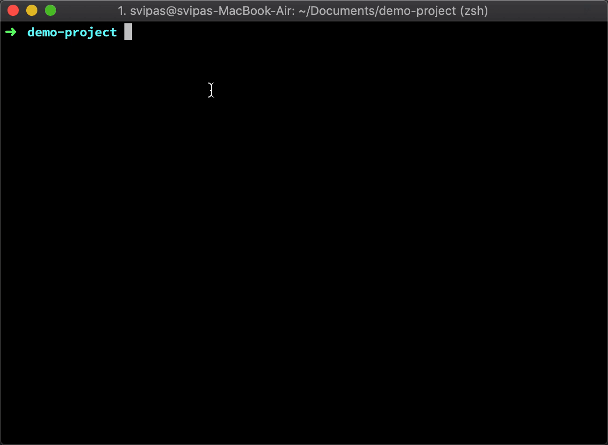

# concurrent-run &middot; [](https://www.npmjs.com/package/concurrent-run) [](https://dev.azure.com/svipas/svipas/_build/latest?definitionId=2&branchName=master)

Simple, zero dependency, multiple commands runner in concurrent mode.



## Installation

### Yarn

`yarn add --dev concurrent-run`

### npm

`npm install --save-dev concurrent-run`

## Documentation

### CLI

`concurrent-run "command1 arg" "command2 arg"`

Always surround multiple commands with quotes, otherwise, everything will be treated as a single command.

### API

```js
const { ConcurrentRun } = require('concurrent-run');
const concurrent = new ConcurrentRun();

concurrent
  .run(['command1 arg', 'command2 arg'])
  .on('data', (data, command, index) => {
    // data from spawned process stderr and stdout
  })
  .on('close', (exitCode, command, index) => {
    // after command is finished
  })
  .on('error', (err, command, index) => {
    // after an error occurs
  });
```

**Events**

- `data` gets called once `stderr` or `stdout` of spawned process sends data.

```js
const concurrent = new ConcurrentRun();
concurrent.run(['command1 arg']).on('data', (data, command, index) => {
  // do something...
});
```

- `close` gets called once command is finished.

```js
const concurrent = new ConcurrentRun();
concurrent.run(['command1 arg']).on('close', (exitCode, command, index) => {
  // do something...
});
```

- `error` gets called once an error occurs.

```js
const concurrent = new ConcurrentRun();
concurrent.run(['command1 arg']).on('error', (err, command, index) => {
  // do something...
});
```
